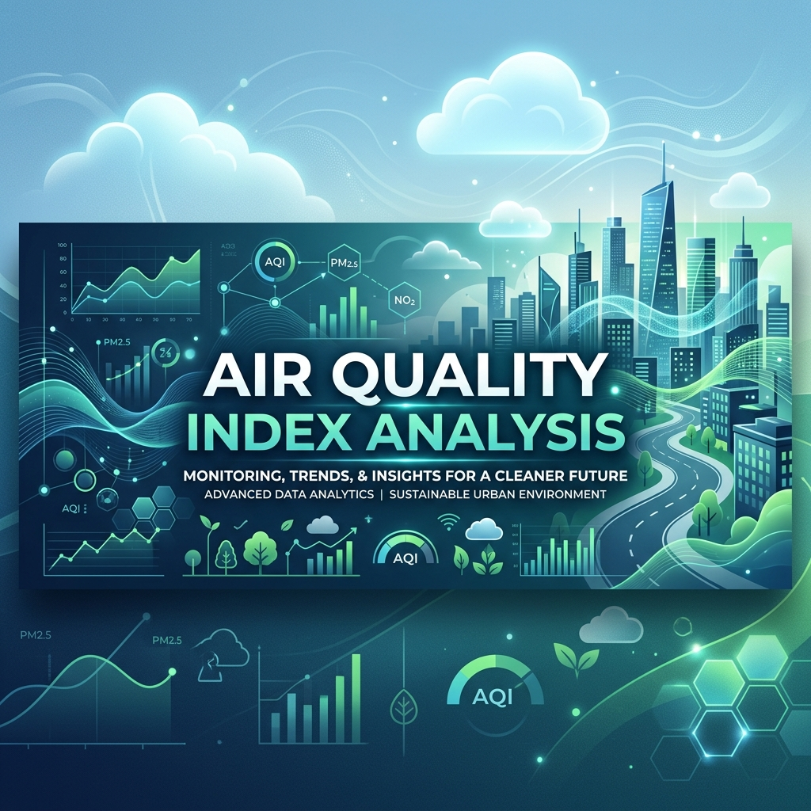

<div align="center">



# 🌬️ Air Quality Index (AQI) Analysis 📊

[](https://github.com/neeraj214/Air-Quality-Index-Analysis/stargazers)
[](https://github.com/neeraj214/Air-Quality-Index-Analysis/network/members)
[](https://github.com/neeraj214/Air-Quality-Index-Analysis/issues)
[](https://github.com/neeraj214/Air-Quality-Index-Analysis)
[](https://github.com/neeraj214/Air-Quality-Index-Analysis)

**A sophisticated Machine Learning system to predict AQI levels across major Indian cities using real-time pollutant data.**

[Exploration](#-exploration) • [Tech Stack](#-tech-stack) • [Installation](#-installation) • [Usage](#-usage) • [Contributing](#-contributing)

</div>

---

## 🚀 Overview

This project provides an end-to-end pipeline for analyzing and predicting Air Quality Index (AQI) levels. It specifically targets major Indian hubs including **Delhi, Bangalore, Kolkata, and Hyderabad**. By leveraging advanced ML algorithms, it predicts pollutant levels and provides a user-friendly dashboard for visualization.

## 🛠️ Tech Stack

<div align="center">

| Area | Technologies |
| :--- | :--- |
| **Frontend** |    |
| **Backend** |    |
| **Machine Learning** |    |
| **Data** |   |

</div>

## ✨ Key Features

- 📈 **Real-time Visualization**: Interactive charts and gauges for pollutant levels.
- 🔮 **Predictive Analytics**: High-accuracy AQI predictions using SMOTE-enhanced datasets.
- 🏙️ **City-wise Analysis**: Tailored insights for specific Indian metropolises.
- 📱 **Responsive Design**: Seamless experience across mobile and desktop.
- ⚡ **Fast API**: High-performance backend for model serving.

## 📅 Project Phases

- [x] **Phase 1: EDA** - Exploratory Data Analysis of pollutant trends.
- [x] **Phase 2: Preprocessing** - Handling missing values and SMOTE for class balance.
- [x] **Phase 3: Model Training** - Comparing XGBoost, LightGBM, and Random Forest.
- [x] **Phase 4: Model Evaluation** - R2 Score, RMSE, and MAE metrics.
- [/] **Phase 5: FastAPI Backend** - Building the REST API.
- [/] **Phase 6: React Frontend** - Developing the dashboard.
- [ ] **Phase 7: Deployment** - Pushing to Vercel and Hugging Face.

## ⚙️ Installation

1. **Clone the repository**
   ```bash
   git clone https://github.com/neeraj214/Air-Quality-Index-Analysis.git
   cd Air-Quality-Index-Analysis
   ```

2. **Setup Backend**
   ```bash
   python -m venv venv
   source venv/bin/activate # or venv\Scripts\activate
   pip install -r requirements.txt
   ```

3. **Setup Frontend**
   ```bash
   cd frontend
   npm install
   npm run dev
   ```

## 🤝 Contributing

Contributions are welcome! Please feel free to submit a Pull Request.

1. Fork the Project
2. Create your Feature Branch (`git checkout -b feature/AmazingFeature`)
3. Commit your Changes (`git commit -m 'Add some AmazingFeature'`)
4. Push to the Branch (`git push origin feature/AmazingFeature`)
5. Open a Pull Request

---

<div align="center">

Made with ❤️ for a Cleaner Environment 🌍

</div>